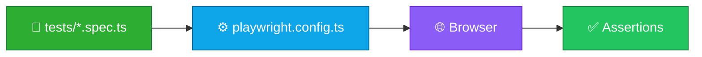

<p align="center">
  
</p>

<h1 align="center">playwright-starter</h1>

<p align="center">
  <strong>EN</strong> Minimal Playwright E2E example (TypeScript)<br/>
  <strong>PT</strong> Exemplo mínimo Playwright E2E (TypeScript)
</p>

<p align="center">
  <a href="https://github.com/manansbdb/playwright-starter/blob/main/LICENSE"></a>
  
  
  <a href="#support--apoio"></a>
</p>

---

## What it does / Para que serve

| English | Português |
|---------|-----------|
| A **minimal Playwright** project with config + one example spec. | Um projeto **Playwright mínimo** com config + um spec de exemplo. |
| `npm install`, install browsers, `npm test`. | `npm install`, instala browsers, `npm test`. |



---

## Install / Instalação

### 1) Clone / Clona

```bash
git clone https://github.com/manansbdb/playwright-starter.git
cd playwright-starter
```

### 2) Install deps & browsers / Instala deps e browsers

```bash
npm install
npx playwright install
```

### 3) Run tests / Corre testes

```bash
npm test
# or UI mode:
npm run test:ui
```

### Copy into an existing app / Copiar para uma app existente

```bash
cp playwright.config.ts /path/to/app/
cp -R tests /path/to/app/
# merge package.json scripts + @playwright/test
```

### Requirements / Requisitos

- Node.js 18+
- `npm`

---

## Quick start / Início rápido

```bash
git clone https://github.com/manansbdb/playwright-starter.git
cd playwright-starter
npm install && npx playwright install && npm test
```

---

## Contents / Conteúdos

| Path | Purpose / Função |
|------|------------------|
| `playwright.config.ts` | Playwright config |
| `tests/example.spec.ts` | Sample E2E test |
| `package.json` | Scripts + dependency |
| `SUPPORT.md` | Donations / Doações |

---

## Project layout / Estrutura

```text
playwright-starter/
├── docs/banner.svg
├── package.json
├── playwright.config.ts
├── tests/example.spec.ts
├── SUPPORT.md
└── README.md
```

---

## Support / Apoio

Bitcoin donations welcome / Doações em Bitcoin bem-vindas:

```
bc1q0qfnlnxyum9u45stzxe0a7jnhtj4j0usfkqdjw
```

See [SUPPORT.md](./SUPPORT.md).

---

## License / Licença

[MIT](./LICENSE) © 2026 manansbdb
