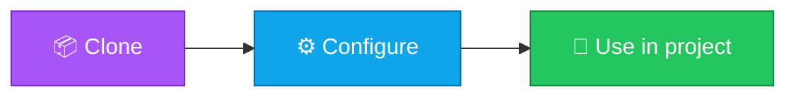

<p align="center">
  
</p>

<h1 align="center">playwright-starter</h1>

<p align="center">
  <strong>EN</strong> Minimal Playwright test example.<br/>
  <strong>PT</strong> Exemplo mínimo de teste Playwright.
</p>

<p align="center">
  <a href="https://github.com/manansbdb/playwright-starter/blob/main/LICENSE"></a>
  
  
  <a href="#support--apoio"></a>
</p>

---

## What it does / Para que serve

| English | Português |
|---------|-----------|
| Minimal Playwright test example. | Exemplo mínimo de teste Playwright. |



---

## Install / Instalação

### 1) Clone

```bash
git clone https://github.com/manansbdb/playwright-starter.git
cd playwright-starter
```

### Use / Usar

```bash
npm i
npx playwright install
npx playwright test
```

### Requirements / Requisitos

- `git`
- No paid services required / Sem serviços pagos

---

## Files / Ficheiros

- `tests/example.spec.ts`
- `playwright.config.ts`
- `package.json`

---

## Support / Apoio

Bitcoin donations welcome / Doações em Bitcoin bem-vindas:

```
bc1q0qfnlnxyum9u45stzxe0a7jnhtj4j0usfkqdjw
```

**Network / Rede:** BTC (Bech32).

---

## License / Licença

[MIT](./LICENSE) © 2026 manansbdb
